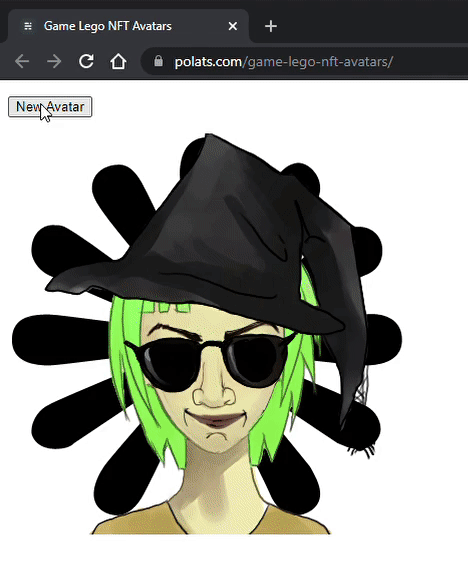

# Game Lego NFT Avatars

### [👆 Demo Here](http://polats.com/game-lego-nft-avatars/)
Create generative avatars from separate PSD layers. 

Uses the Open Raster format (.ora) and the jsora library to easily create and render the avatar parts.

Open Raster files can be generated from PSD by exporting from [GIMP](https://www.gimp.org/).

## Sources

jsora by [InkLabApp](https://twitter.com/inklabapp) : https://gitlab.com/inklabapp/jsora

Avatar Graphics downloaded from opengameart.org:
https://opengameart.org/content/avatar-generator-with-15-trillion-combinations

Avatar graphics created by [Noble Master Games](http://www.noblemaster.com)

Avatar graphics designed by [Mei-Li Nieuwland](http://liea.deviantart.com)
   